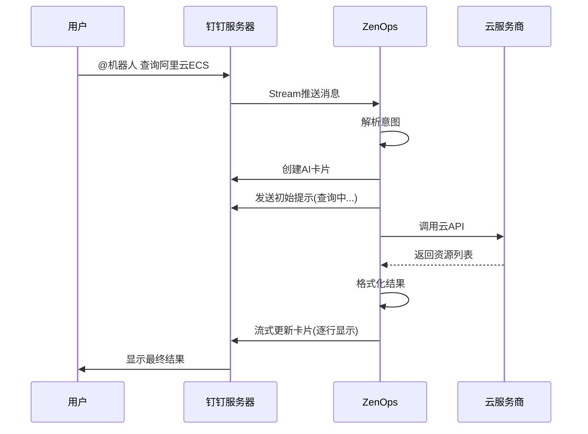

# ZenOps 钉钉机器人 Stream 模式使用指南

## 📖 概述

ZenOps 已成功实现钉钉 Stream 模式支持!这意味着:

- ✅ **无需公网地址** - 可以在本地/内网运行
- ✅ **无需配置回调** - 不需要配置 HTTP 回调 URL
- ✅ **开箱即用** - 配置简单,快速启动
- ✅ **实时响应** - WebSocket 长连接,消息实时推送
- ✅ **AI 卡片流式更新** - 支持实时流式显示查询结果

## 🎯 快速开始

### 1. 配置钉钉机器人

#### 1.1 创建钉钉应用

1. 登录 [钉钉开放平台](https://open-dev.dingtalk.com/)
2. 进入 **应用开发** → **企业内部开发** → **机器人**
3. 创建机器人应用

#### 1.2 获取凭证

在应用详情页面获取:
- **AppKey** (Client ID)
- **AppSecret** (Client Secret)
- **AgentID** (可选)

#### 1.3 配置权限

在 **权限管理** 中开通:
- ✅ 企业内机器人发送消息
- ✅ 通讯录只读权限

#### 1.4 开启 Stream 推送

1. 进入 **开发配置** → **事件订阅**
2. 选择 **Stream 模式**
3. 订阅 **机器人接收消息** 事件

#### 1.5 创建 AI 卡片模板(可选)

如果需要流式卡片更新效果:
1. 进入 **AI 卡片** → **创建模板**
2. 添加一个 markdown 字段,命名为 `content`
3. 记录模板 ID (TEMPLATE_ID)

### 2. 配置 ZenOps

#### 2.1 设置环境变量

```bash
# 复制环境变量模板
cp .env.example .env

# 编辑配置文件
vim .env
```

**必需配置:**
```bash
export DINGTALK_APP_KEY='dingxxxxxxxx'
export DINGTALK_APP_SECRET='your_app_secret_here'
```

**可选配置:**
```bash
# AI 卡片模板 ID(用于流式更新)
export DINGTALK_TEMPLATE_ID='xxxxxxxx-xxxx-xxxx-xxxx-xxxxxxxxxxxx'

# AgentID(如果有)
export DINGTALK_AGENT_ID='xxxxxxxxxx'
```

**云服务商配置:**
```bash
# 阿里云
export ALIYUN_ACCESS_KEY_ID='your_ak'
export ALIYUN_ACCESS_KEY_SECRET='your_sk'

# 腾讯云
export TENCENT_SECRET_ID='your_id'
export TENCENT_SECRET_KEY='your_key'
```

#### 2.2 加载环境变量

```bash
source .env
```

#### 2.3 验证配置

```bash
./scripts/validate_config.sh
```

### 3. 启动服务

```bash
# 方式1: 使用测试脚本(推荐,包含环境检查)
./scripts/test_dingtalk_stream.sh

# 方式2: 直接启动
./bin/zenops serve

# 方式3: Debug 模式
./bin/zenops serve --log-level debug
```

成功启动后,你会看到:
```
[INFO] Starting DingTalk in Stream mode
[INFO] DingTalk Stream mode started successfully app_key=dingxxxx...
[INFO] Starting DingTalk Stream client
[INFO] DingTalk Stream client connecting...
```

### 4. 测试机器人

#### 在群聊中使用

1. 将机器人添加到群聊
2. @机器人 发送消息

```
@ZenOps 帮助
@ZenOps 查询阿里云 ECS
@ZenOps 列出腾讯云广州的 CVM
```

#### 私聊使用

直接发送消息(无需@):
```
帮助
查询阿里云杭州的 ECS
找一下 IP 为 192.168.1.1 的服务器
```

## 💬 支持的命令

### 获取帮助
```
帮助
help
```

### 阿里云 ECS
```
列出阿里云 ECS
查询阿里云杭州的 ECS
查询阿里云上海的 ECS 服务器
找一下 IP 为 192.168.1.1 的服务器
查询名为 web-server 的实例
搜索名称叫 nginx 的 ECS
```

### 阿里云 RDS
```
列出阿里云 RDS
查询阿里云 RDS 数据库
列出阿里云杭州的 RDS
查询 RDS 名称为 mysql-prod
```

### 腾讯云 CVM
```
列出腾讯云 CVM
查询腾讯云 CVM
查询腾讯云广州的服务器
找腾讯云 IP 10.0.0.1 的机器
查询腾讯云名为 api-server 的 CVM
```

### 腾讯云 CDB
```
列出腾讯云 CDB
查询腾讯云 CDB 数据库
列出腾讯云广州的 CDB
```

### Jenkins(如果启用)
```
看一下 Jenkins 任务
列出 Jenkins Job
查询 deploy-prod 的构建历史
```

## 🔧 配置说明

### config.yaml 配置项

```yaml
dingtalk:
  enabled: true              # 是否启用钉钉机器人
  mode: stream               # 模式: stream 或 http
  app_key: ${DINGTALK_APP_KEY}
  app_secret: ${DINGTALK_APP_SECRET}
  agent_id: ${DINGTALK_AGENT_ID}      # 可选
  template_id: ${DINGTALK_TEMPLATE_ID} # AI 卡片模板 ID(可选)
  callback:                   # HTTP 模式配置(Stream 模式不需要)
    token: ${DINGTALK_CALLBACK_TOKEN}
    aes_key: ${DINGTALK_AES_KEY}
    url: https://your-domain.com/api/v1/dingtalk/callback
```

### Stream 模式 vs HTTP 模式

| 特性 | Stream 模式 | HTTP 模式 |
|------|------------|-----------|
| 需要公网地址 | ❌ 否 | ✅ 是 |
| 本地开发友好 | ✅ 是 | ❌ 否 |
| 配置复杂度 | 🟢 简单 | 🟡 中等 |
| 实时性 | 🟢 实时 | 🟡 取决于网络 |
| 推荐场景 | 内网/本地开发 | 生产环境/云部署 |

## 📊 工作流程



## 🐛 故障排查

### 问题 1: 服务启动失败

**错误信息:**
```
failed to create dingtalk service: dingtalk is not enabled
```

**解决方法:**
检查 `config.yaml` 中 `dingtalk.enabled` 是否为 `true`

---

### 问题 2: Token 获取失败

**错误信息:**
```
[ERROR] Failed to get access token error=invalid appkey
```

**解决方法:**
1. 检查 `DINGTALK_APP_KEY` 和 `DINGTALK_APP_SECRET` 是否正确
2. 确认环境变量已正确加载: `echo $DINGTALK_APP_KEY`
3. 重新从钉钉开放平台复制凭证

---

### 问题 3: Stream 连接失败

**错误信息:**
```
[ERROR] DingTalk Stream client connection failed
```

**解决方法:**
1. 检查网络连接
2. 确认钉钉开放平台 Stream 推送已开启
3. 检查防火墙是否拦截 WebSocket 连接
4. 确认订阅了"机器人接收消息"事件

---

### 问题 4: 机器人无响应

**可能原因:**
- 机器人未被@(群聊场景)
- 消息格式不匹配
- 服务未正常运行

**解决方法:**
1. 检查服务日志,确认收到消息: `grep "Received chatbot message" logs`
2. 发送 "帮助" 测试基本功能
3. 确认机器人在群里或已添加为好友

---

### 问题 5: AI 卡片创建失败

**错误信息:**
```
[ERROR] Failed to create and deliver card
```

**解决方法:**
1. 检查 `DINGTALK_TEMPLATE_ID` 是否正确
2. 确认应用有 AI 卡片权限
3. 暂时注释掉 `template_id` 配置,使用文本消息模式

---

### 问题 6: 查询无结果

**可能原因:**
- 云服务商凭证未配置
- 区域配置错误
- 资源确实不存在

**解决方法:**
1. 检查云服务商环境变量是否设置
2. 使用 Debug 模式查看详细日志
3. 直接调用 MCP 工具测试

## 📝 日志分析

### 正常流程日志

```bash
# 1. 服务启动
[INFO] Starting DingTalk in Stream mode
[INFO] DingTalk Stream mode started successfully

# 2. 收到消息
[INFO] Received chatbot message sender=张三

# 3. 解析意图
[DEBUG] Parsing intent message=查询阿里云ECS
[INFO] Intent parsed provider=aliyun resource=ecs

# 4. 调用工具
[DEBUG] Calling MCP tool tool=list_ecs

# 5. 返回结果
[DEBUG] Streaming update card finalize=true
```

### 启用 Debug 日志

```bash
./bin/zenops serve --log-level debug
```

## 🎨 AI 卡片模板示例

如果你想自定义 AI 卡片样式,可以在钉钉开放平台创建以下模板:

```json
{
  "type": "markdown",
  "text": {
    "content": "${content}"
  }
}
```

字段说明:
- `content`: 必需字段,用于显示 markdown 格式的查询结果

## 🔐 安全建议

1. **环境变量管理**
   - 不要将 `.env` 文件提交到版本控制
   - 使用密钥管理服务(如 Vault)
   - 定期轮换密钥

2. **权限最小化**
   - 只开通必需的钉钉权限
   - 云服务商使用只读权限

3. **网络安全**
   - 使用防火墙限制访问
   - 启用 HTTPS/WSS

## 📚 相关文档

- [ZenOps 主文档](README.md)
- [钉钉 Stream 模式官方文档](https://open.dingtalk.com/document/orgapp/stream-mode-overview)
- [AI 卡片开发指南](https://open.dingtalk.com/document/orgapp/instructions-for-use)
- [钉钉机器人开发文档](https://open.dingtalk.com/document/orgapp/robot-overview)

## 🤝 贡献

欢迎提交 Issue 和 PR!

## 📄 许可证

MIT License
